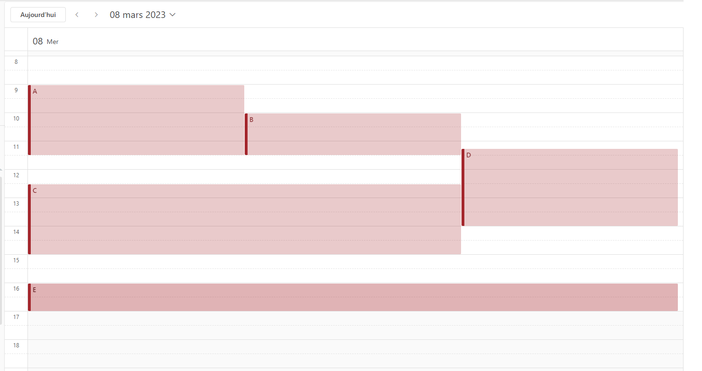

# 📅 RENDERING EVENTS 📅


# Sujet


## L'objectif: Afficher des évenements sur un calendrier. 

La position relative des événements se calcule en en fonction de la bordure supérieure de la fenêtre, l'heure et la durée des événements.
Par exemple : si le calendrier va de 00:00 à 24:00 et que l'écran est de 2400px de haut, un événement commençant à 12h00 et durant 1h sera positionné à 1200px du haut de l'écran et aura une hauteur de 100px.

___
## Chevauchement d'évenements
Les évenement peuvent recouvrir une même plage horaire. Auquel cas, on parle de _chevauchement_. Le _chevauchement_ de 2 évenements ne doit pas empêcher leur visibilité.


Votre implémentation doit respecter les deux contraintes suivantes:

`1. Tous les événements en chevauchement a la même largeur que chaque événement avec lequel ils se chevauchent.`

`2. Chaque événement utilise la largeur maximale disponible, tout en respectant la contrainte #1`

Une illustration visuelle du problème est donnée ci-dessous.


Utiliser la largeur maximale disponible signifie qu'un groupe d'évenements en chevauchement sur une même plage horaire occupera la largeur de la fenêtre.

___

## Input

L'input fournie dans ce repository est un tableau d'évenements ayant lieu le même jour (à des heures différentes)


```javascript
{
  id: 1,
  start: '15:00', // The event starts at 03:00 pm
  duration: 90 // The duration is expressed in minutes
}
```
___

## Output


Votre code devrait afficher les événements sur une page Web dans un conteneur couvrant toute la fenêtre.
Le haut de la page représente 09h00. Le bas de la page représente 21h00.

Les événements devraient être représentés sous forme de `div` avec une couleur de fond et une bordure de 1px. La `div` doit afficher l'identifiant de l'événement.

Votre implémentation devrait être responsive (c'est-à-dire répondre aux événements `resize` de la fenêtre).


___
## ⚠️ Dépendences ⚠️

Utiliser React (ou autre framework front équivalent). **Aucune autre librairie** qui ne soit pas purement utilitaire (ex: lodash) ou purement axée graphique / templating (ex: material UI)


___

## Illustration visuelle du problème

**1 event**

```
┌────────────┐
|            |
└────────────┘
```

**2 events**

```
┌─────┐┌─────┐         // OK     
|     |└─────┘
└─────┘
```

**3 events tels que 1, 2 et 3 se chevauchent, mais pas 1 et 3**

```
┌─────┐
|  1  |┌─────┐         // OK
└─────┘|     |
       |  2  |
┌─────┐|     |
|  3  |└─────┘
└─────┘
```

**Cette configuration ci-dessus répond à toutes les contraintes. Attention, celle ci-dessous ne satisfait pas la constrainte #2 :**

```
┌───┐
| 1 |┌───┐             // KO: la contrainte #2 n'est pas respectée
└───┘|   |
     | 2 |
     |   |┌───┐
     └───┘| 3 |
          └───┘
```


**Dans les schémas ci-dessous, on assume que la fenêtre a la largeur de l'event 1**

```
┌────────────┐
|     1      |         // OK
└────────────┘

┌─────┐┌─────┐
|     ||  3  |
|  2  |└─────┘
|     |
└─────┘

┌─────┐
|  4  |┌─────┐
└─────┘|     |
       |  5  |
┌─────┐|     |
|  6  |└─────┘
└─────┘
```


```
┌────────────┐ 
|     1      |
└────────────┘      // KO: la contrainte #2 n'est pas respectée

┌─────┐┌─────┐
|     ||  3  |
|  2  |└─────┘
|     |
└─────┘

┌───┐┌───┐
|   || 5 |
| 4 |└───┘
|   |
└───┘
```

___


_la version Microsoft Outlook ..._

# Note d'intention

## Objectifs et Contexte

> Motivation derrière le kata

De plus en plus d’équipes de développement adoptent le paradigme **full-stack**, en demandant à tous leurs développeurs d’être en mesure de prendre en charge une tâche de front comme de back, selon les priorités du moment. 
 

Les profils full-stack ayant un background orienté backend auront souvent plus de difficultés à s’emparer des concepts bas-niveau du front, qu’ils contournent en se cantonnant à des affichages très simplistes & des composants déjà existants. 

 
L’objectif de ce kata : challenger la compréhension du front bas-niveau du candidat, en construisant **un composant complexe from-scratch**. 
___

## Specification [RFC2119](https://microformats.org/wiki/rfc-2119-fr) du kata

> Description précise & sans ambiguité sur les termes de ce qui est attendu

**1. Fonctionnalité du projet**
 * Le défilement des évènements `DOIT` commencer à l’ouverture de la page web et satisfaire autant que possible les contraintes du sujet
 * Le projet `DOIT` pouvoir être ouvert sur n’importe quel navigateur 

**2. Démonstration du frontend craftsmanship**
* Le projet `NE DOIT PAS` utiliser d’imports de librairies autres que librairies nécessaires au fonctionnement du framework utilisé (ex React: “react”, “react-dom”, ...) 
* L’affichage `DEVRAIT` être [responsive](https://www.usabilis.com/responsive-web-design-site-web-adaptatif/)
* Le projet `DEVRAIT` être implémenté en JS moderne [ES6](https://www.w3schools.com/js/js_es6.asp) 
* Le projet `PEUT` être implémenté en Typescript 
* Les informations `DEVRAIENT` être facilement lisibles et agréables à l’oeil 